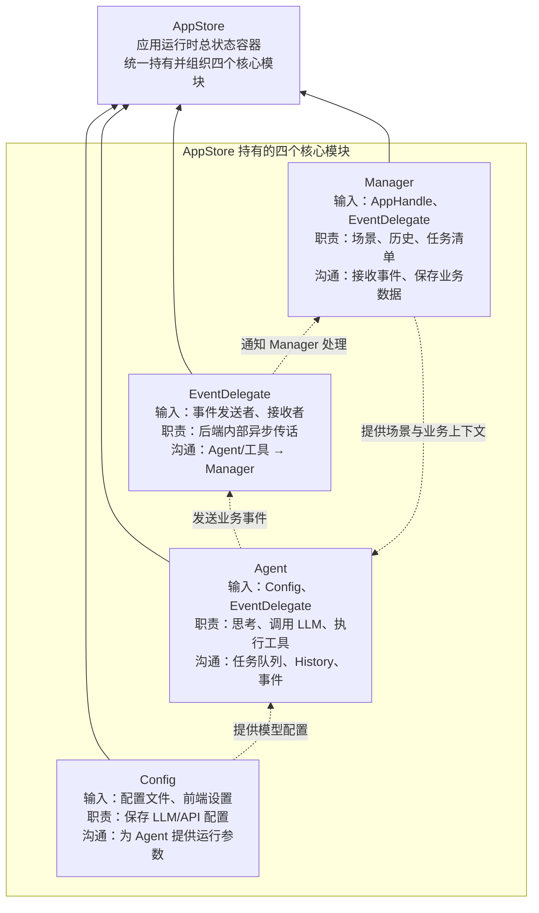

# CleanPilot 后端核心模块

```mermaid
flowchart BT
    subgraph CORE[AppStore 持有的四个核心模块]
        direction LR

        A["Agent<br/>输入：Config、EventDelegate<br/>职责：思考、调用 LLM、执行工具<br/>沟通：任务队列、History、事件"]
        C["Config<br/>输入：配置文件、前端设置<br/>职责：保存 LLM/API 配置<br/>沟通：为 Agent 提供运行参数"]
        M["Manager<br/>输入：AppHandle、EventDelegate<br/>职责：场景、历史、任务清单<br/>沟通：接收事件、保存业务数据"]
        E["EventDelegate<br/>输入：事件发送者、接收者<br/>职责：后端内部异步传话<br/>沟通：Agent/工具 → Manager"]
    end

    STORE["AppStore<br/>应用运行时总状态容器<br/>统一持有并组织四个核心模块"]

    A --> STORE
    C --> STORE
    M --> STORE
    E --> STORE

    C -. "提供模型配置" .-> A
    M -. "提供场景与业务上下文" .-> A
    A -. "发送业务事件" .-> E
    E -. "通知 Manager 处理" .-> M
```
