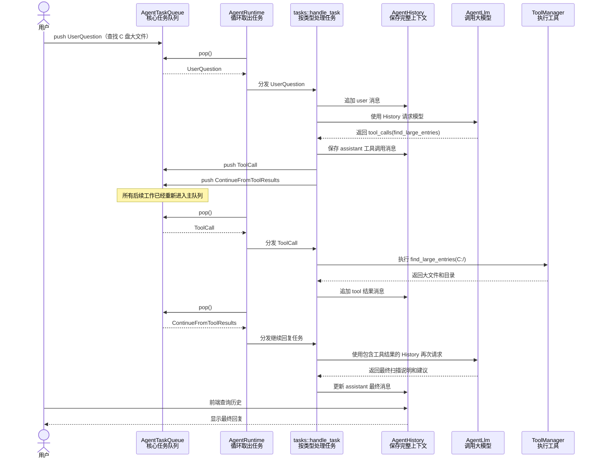

# Agent 模块结构与运行流程

## 1. AgentRuntime 持有的组件

```mermaid
flowchart LR
    RUNTIME["AgentRuntime<br/><br/>Agent 的运行时主体<br/>持有所有核心组件<br/>循环处理任务"]

    subgraph COMPONENTS[AgentRuntime 持有]
        direction TB

        HISTORY["history: AgentHistory<br/>保存系统提示词、对话和工具结果"]
        TASKS["tasks: AgentTaskQueue<br/>保存等待处理的 Agent 任务"]
        LLM["llm: AgentLlm<br/>读取配置并调用大模型"]
        TOOLS["tools: ToolManager<br/>管理并执行当前可用工具"]
        STATUS["status: AgentStatus<br/>记录 Idle 或 Chatting 状态"]
        EVENT["event_delegate: EventDelegate<br/>向 Manager 发送业务事件"]
    end

    RUNTIME --> HISTORY
    RUNTIME --> TASKS
    RUNTIME --> LLM
    RUNTIME --> TOOLS
    RUNTIME --> STATUS
    RUNTIME --> EVENT
```

## 2. 一次包含工具调用的运行流程

假设用户问：**“帮我找一下 C 盘占空间最大的文件。”**

`AgentRuntime` 不决定下一步做什么，它只负责反复执行同一件事：从 `AgentTaskQueue` 取出一个任务，再根据任务类型分发。模型产生工具调用后，也必须先重新进入队列，之后才会被运行时执行。
