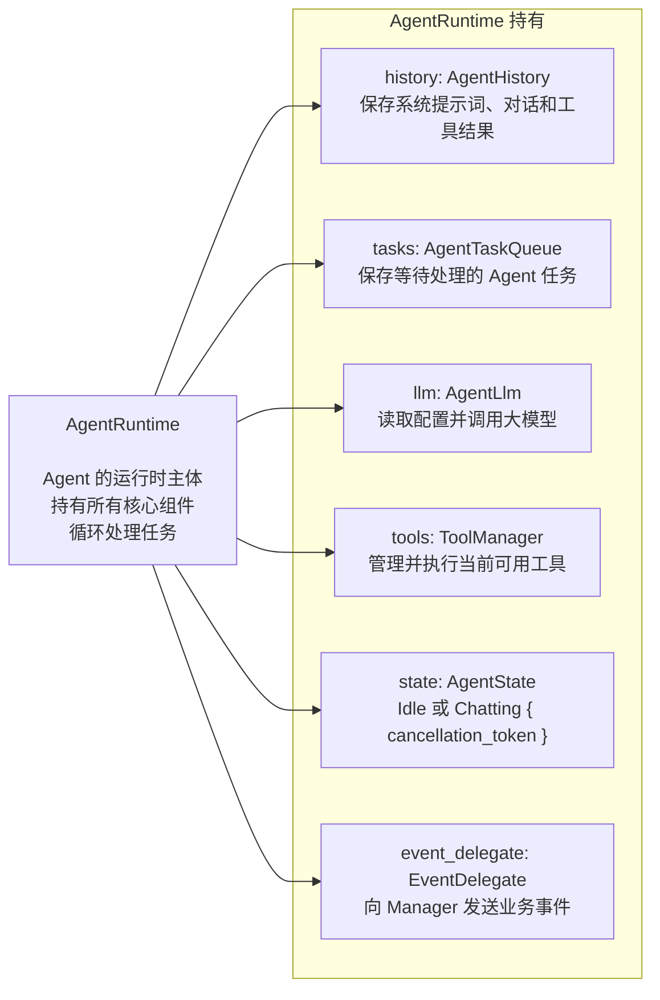
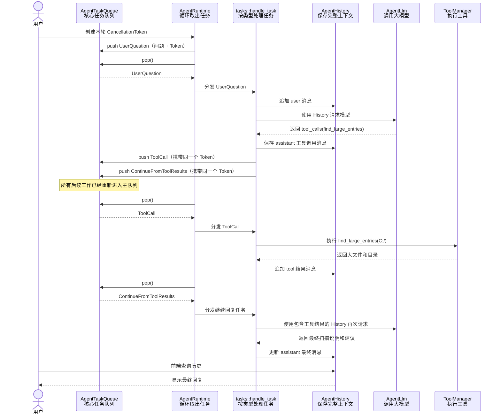
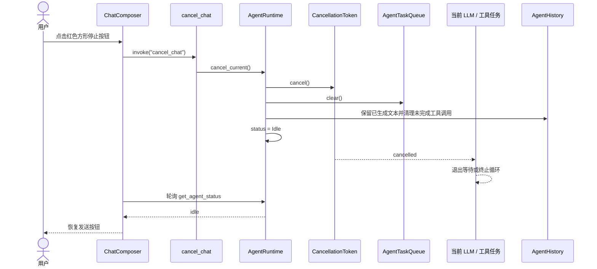

# Agent 模块结构与运行流程

## 1. AgentRuntime 持有的组件

## 2. 一次包含工具调用的运行流程

假设用户问：**“帮我找一下 C 盘占空间最大的文件。”**

`AgentRuntime` 不决定下一步做什么，它只负责反复执行同一件事：从 `AgentTaskQueue` 取出一个任务，再根据任务类型分发。模型产生工具调用后，也必须先重新进入队列，之后才会被运行时执行。

## 3. 请求取消机制

每次用户发送问题时，`AgentRuntime` 都会调用 `AgentState::begin()` 创建一个独立的 `CancellationToken`，并进入 `AgentState::Chatting { cancellation_token }`。这个令牌会跟随 `UserQuestion`、该轮产生的所有 `ToolCall` 以及 `ContinueFromToolResults` 一起进入任务队列。令牌只会从“可运行”变为“已取消”，不会被重置；下一轮请求会创建一个全新的令牌。

LLM 建连、流式回复循环、工具调用前后以及工具内部的目录遍历等长循环都会检查令牌。HTTP 请求和异步消息发送使用 `tokio::select!` 同时等待业务结果与取消通知，因此不必等到网络请求自然结束才响应取消。

取消时会保留 assistant 已经生成的文本。若已经进入工具调用阶段，则清除未完成的 `tool_calls` 及其后续工具消息，避免下一轮请求携带缺少对应 `tool` 结果的无效消息组合。

前端通过共享的 `useAgentStatus` 状态轮询同时驱动工作提示和发送按钮：状态为 `chatting` 时显示红色方形终止按钮，状态为 `idle` 时显示普通发送按钮。

Runtime 使用一个状态值同时表达运行状态和当前令牌：`Idle` 不包含令牌，`Chatting` 必然包含令牌。这样避免了分别维护 `status` 与 `Option<CancellationToken>` 时可能出现的不一致组合。

`state.rs` 只负责 `AgentState` 自身的开始、取消、完成和状态查询；清空任务队列、整理取消后的历史记录等跨组件操作仍由 `AgentRuntime` 编排。
