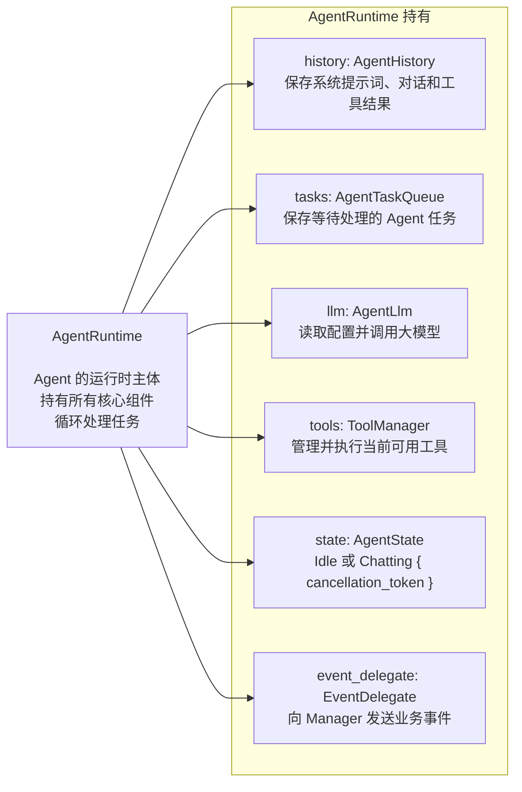
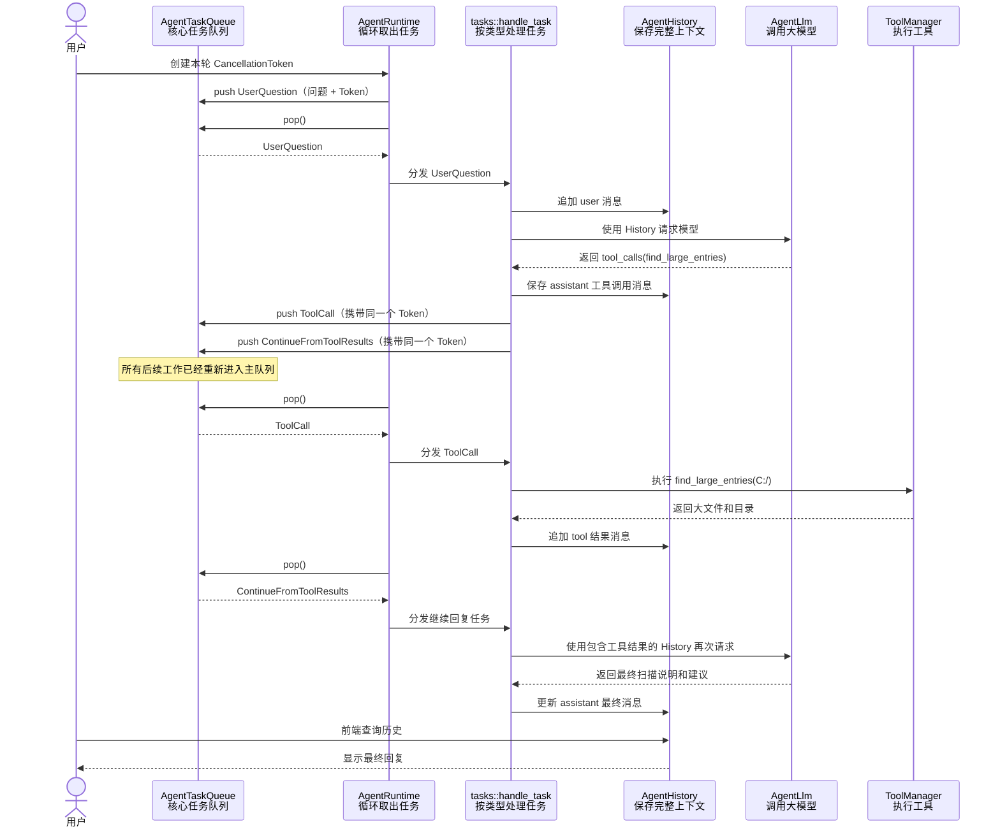
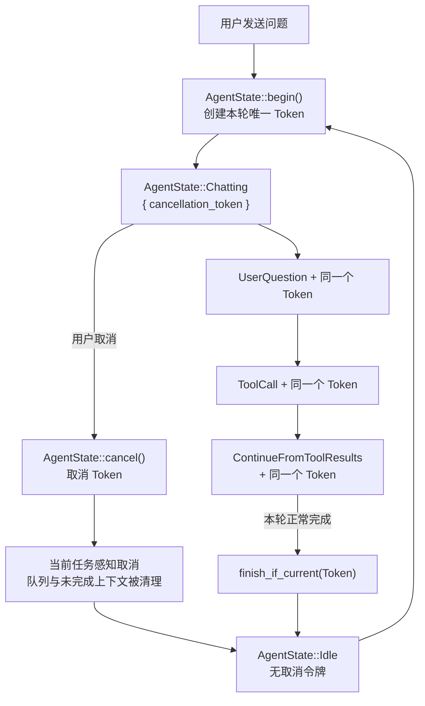

# Agent 模块结构与运行流程

## 1. AgentRuntime 持有的组件

## 2. 一次包含工具调用的运行流程

假设用户问：**“帮我找一下 C 盘占空间最大的文件。”**

`AgentRuntime` 不决定下一步做什么，它只负责反复执行同一件事：从 `AgentTaskQueue` 取出一个任务，再根据任务类型分发。模型产生工具调用后，也必须先重新进入队列，之后才会被运行时执行。

## 3. 请求取消机制

取消机制的核心是 `AgentState`：它同时表示 Agent 的运行状态，并持有当前这轮对话的 `CancellationToken`。`Idle` 没有令牌，`Chatting { cancellation_token }` 则表示一轮请求正在执行，因此不会出现“显示正在运行但没有可取消令牌”之类的不一致状态。

用户发送问题时，`AgentRuntime` 调用 `AgentState::begin()` 创建本轮唯一的令牌，再把同一个令牌共享给 `UserQuestion` 以及随后产生的所有工具和继续回复任务。主动取消时，`AgentState::cancel()` 取消该令牌并回到 `Idle`；正常结束时，`finish_if_current()` 只允许持有当前令牌的任务结束本轮状态。

各任务只负责传播并检查这枚共享令牌；`AgentRuntime` 负责跨组件收尾，包括清空待执行任务，以及保留已生成文本、移除未完成的工具调用上下文。
