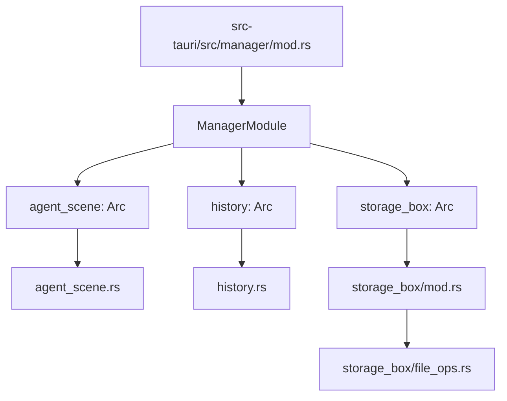
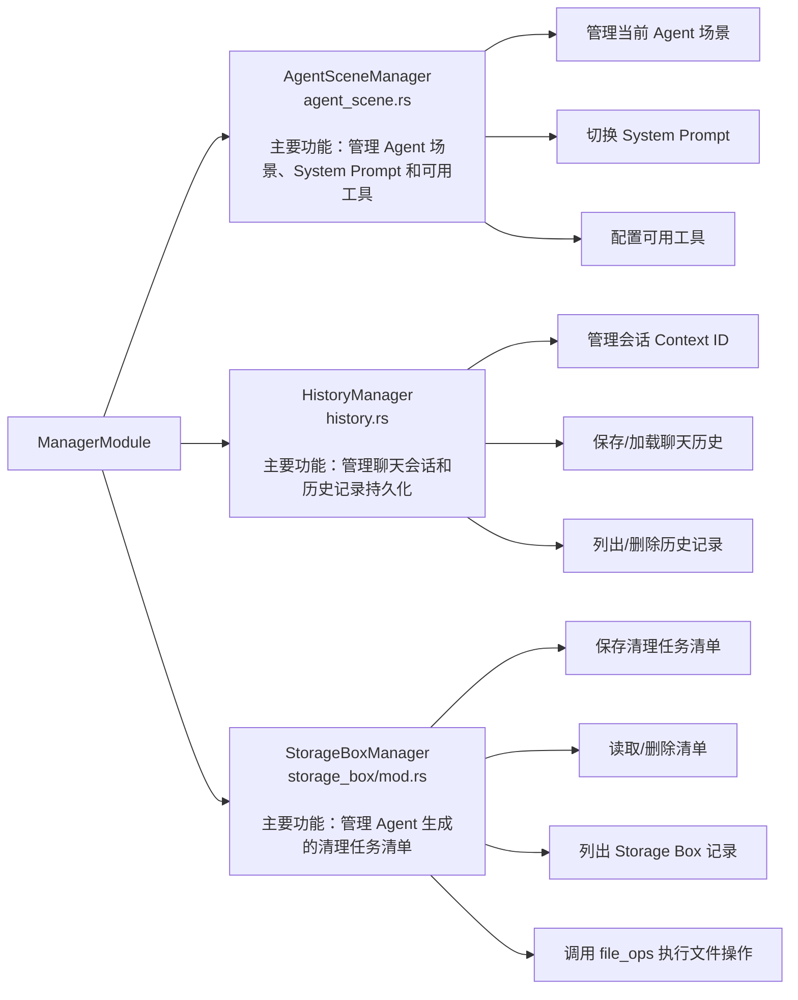
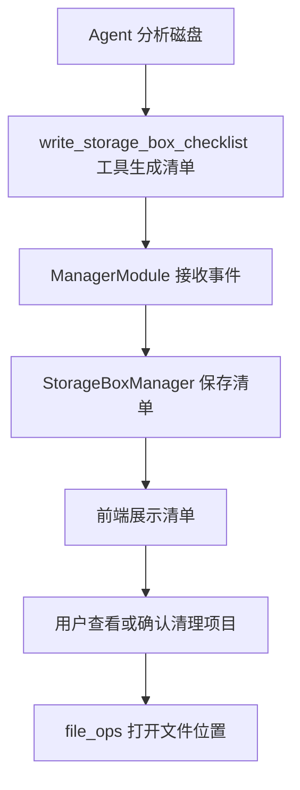

# Manager 模块拓扑结构

## 目录与 `ManagerModule` 的关系

`ManagerModule` 定义在 `src-tauri/src/manager/mod.rs` 中，统一持有三个管理器。

## 三个管理器的职责

### `ManagerModule`

文件位置：`src-tauri/src/manager/mod.rs`

管理模块的总入口，负责创建、组合和协调三个管理器，同时监听 Agent 工具事件并触发清单保存。

### `AgentSceneManager`

文件位置：`src-tauri/src/manager/agent_scene.rs`

管理 Agent 当前业务场景，并根据场景更新 System Prompt 和可用工具。

### `HistoryManager`

文件位置：`src-tauri/src/manager/history.rs`

管理聊天会话上下文，以及历史记录的保存、恢复、列出和删除。

历史记录目录：`Tauri app_data_dir/history/`

### `StorageBoxManager`

文件位置：`src-tauri/src/manager/storage_box/mod.rs`

保存 Agent 生成的磁盘清理候选清单，并提供清单的读取、删除和列出功能。

Storage Box 目录：`Tauri app_data_dir/storage_box/`

### `file_ops`

文件位置：`src-tauri/src/manager/storage_box/file_ops.rs`

提供在 Windows 资源管理器中定位清单文件或目录等系统文件操作。

## 典型调用流程

