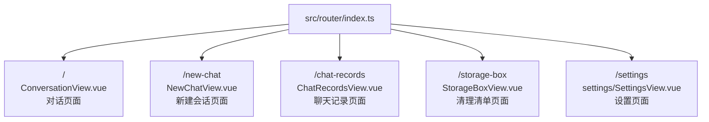
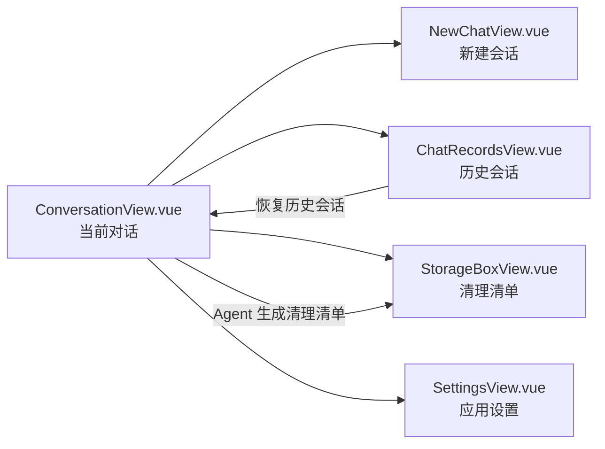

# 前端页面对应关系

当前前端通过 `src/router/index.ts` 配置了 5 个主要页面路由。

## 五个页面

| 路由 | 页面文件 | 主要用途 |
|---|---|---|
| `/` | [ConversationView.vue](./ConversationView.vue) | 显示当前 Agent 对话、消息和输入框 |
| `/new-chat` | [NewChatView.vue](./NewChatView.vue) | 创建新的聊天会话并清空当前上下文 |
| `/chat-records` | [ChatRecordsView.vue](./ChatRecordsView.vue) | 显示历史会话列表，并支持恢复或删除会话 |
| `/storage-box` | [StorageBoxView.vue](./StorageBoxView.vue) | 显示并管理磁盘清理候选清单 |
| `/settings` | [settings/SettingsView.vue](./settings/SettingsView.vue) | 配置应用设置，例如模型和存储目录 |

## 页面之间的关系

## 补充说明

`NavSidebar.vue` 位于 `src/pages` 目录下，但它不是一个独立路由页面，而是页面导航侧边栏组件，负责跳转到上述页面。

设置页面下还有两个子组件：

- `settings/components/LlmConfigSetting.vue`：LLM 配置界面。
- `settings/components/StorageDirectorySetting.vue`：存储目录配置界面。
